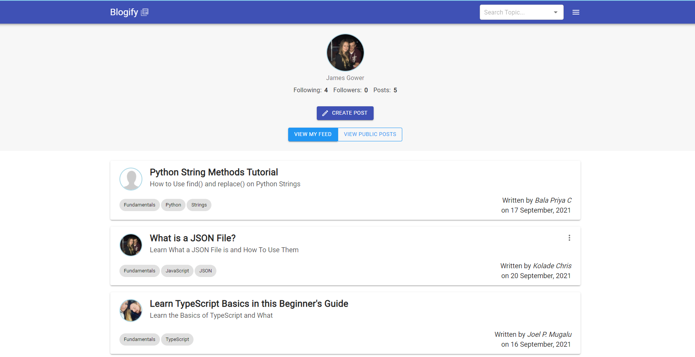
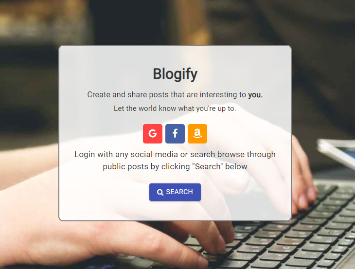
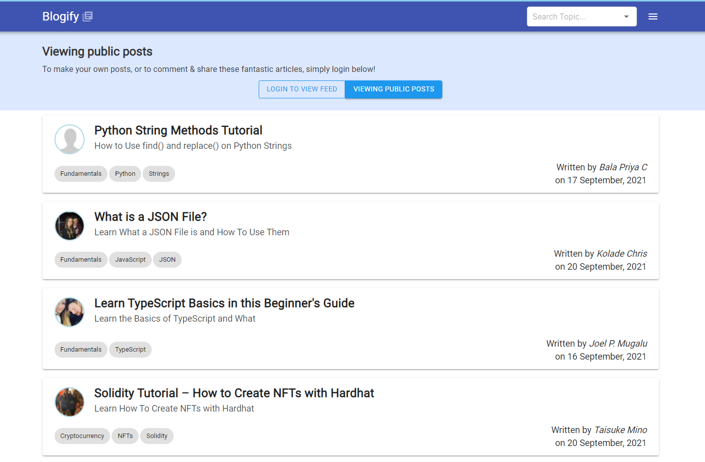
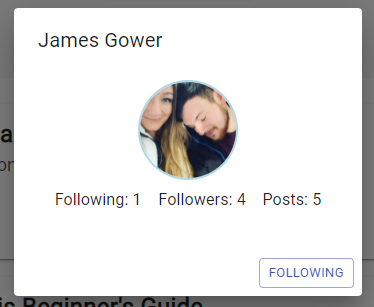

# Blogify

A blogging site created with a TypeScript & React front-end, and an AWS back-end (Cognito, Amplify, AppSync, DynamoDB, IAM)

## Table of Contents
  - [General Information](#general-information)
  - [Technologies](#technologies)
  - [Usage](#usage)
  - [Viewing Your Feed](#viewing-your-feed)
  - [Viewing Public Posts](#viewing-public-posts)
  - [Search](#search)
  - [Following/Unfollowing Users](#followingunfollowing-users)
  - [Status](#status)
  - [Todo](#todo)

## General Information

Blogify is an application I created mainly to test my ability to refactor an app to contain AWS services. It is a blogging application that has social features, like following users and their posts and placing them onto your own personal feed.

## Technologies

-  React 17
-  Redux
-  TypeScript
-  GraphQL
-  Babel
-  Material UI
-  Quill (React Quill)
-  React Router DOM
-  Webpack
-  AWS Amplify
-  AWS AppSync
-  AWS DynamoDB 
-  AWS Cognito
-  AWS S3
-  AWS IAM

## Usage

To use the application, navigate to [this](https://master.d3vh9iezj1hmlb.amplifyapp.com/) link and authenticate yourself, or simply browse the posts by clicking the "Search" button.

### Viewing Your Feed

If you are logging in for the first time, your feed will be empty. To begin filling up your feed you can either create your first post (by clicking on the Create Post button, or by following the link in the navbar), or you can start following users. All followed users' posts will appear in your feed.

### Viewing Public Posts

If you are viewing public posts you will be greeting with a selection of posts which other users have created - but only the ones that they have selected to be public. This can be a good way to find new users to follow.

### Search

To search for a specific topic you can use the search bar located in the navbar (or within the Search page). The input is an autocomplete field, so you can pick on of the autocomplete fields if necessary.

### Following/Unfollowing Users

To follow/unfollow a user you can click on the users image, which will open up a dialog with the users' details (like shown below). Simply click to follow/unfollow button to complete the action.

## Status

The status of the project is it's currently in a working state and pushed to production, however updated tests and some minor features are still being produced.

## Todo

- Tests will be refactored and uploaded ASAP